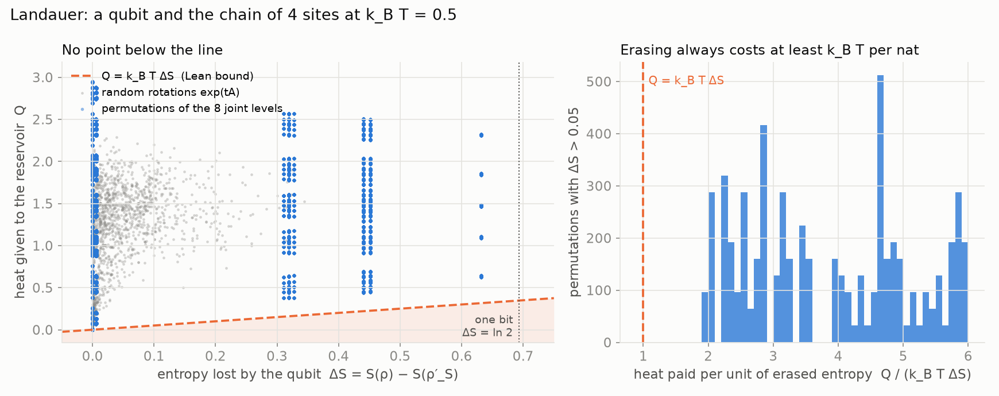
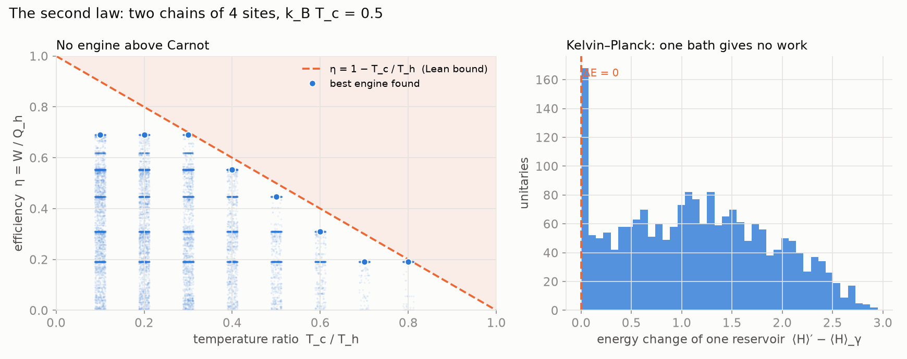

# NRS³ · Landauer and Carnot

The second law as a limit, in Lean 4. **Erasing information costs heat**: a system that loses
entropy `ΔS` to a reservoir at temperature `T` gives it at least `k_B T ΔS` (Landauer; one bit,
`k_B T ln 2`). **No engine beats Carnot**: between reservoirs at `T_h` and `T_c` the work is at
most `(1 − T_c / T_h)` of the heat taken in, and a single reservoir gives no work at all
(Kelvin–Planck). Both come from one inequality, Klein's: the thermal state has the most entropy at
its mean energy.

**[▶ Try it: erase a bit into a chain of d sites](https://naype888-cloud.github.io/nrs3-landauer-carnot/)** ·
**[▶ Try it: build engines between two chains](https://naype888-cloud.github.io/nrs3-landauer-carnot/carnot.html)**



## Landauer

| Statement | Lean |
|---|---|
| `log (exp A) = A` for Hermitian `A`; the Gibbs state `γ = exp(−βH) / Z` | `HermitianMat.log_exp`, `MState.gibbsState` |
| `S(γ) = β ⟨H⟩_γ + log Z` | `MState.Sᵥₙ_gibbsState` |
| Klein: `S(σ) ≤ β ⟨H⟩_σ + log Z` for every state `σ` | `MState.Sᵥₙ_le_gibbs` |
| `S(ρ ⊗ σ) = S(ρ) + S(σ)`; `S(U ρ U†) = S(ρ)` | `MState.Sᵥₙ_prod`, `MState.Sᵥₙ_uConj` |
| `S(ρ) − S(ρ′_S) ≤ β (⟨H⟩_{ρ′_R} − ⟨H⟩_γ)`, `ρ′ = U (ρ ⊗ γ) U†` | `MState.landauer` |
| at temperature `T`: `k_B T ΔS ≤ Q`; one bit: `k_B T ln 2 ≤ Q` | `MState.landauer_temperature`, `MState.landauer_bit` |

Finite-dimensional system and reservoir, any Hamiltonian `H`, any unitary `U` on the pair.
Temperature and `k_B` are Physlib's (`Temperature`, `Constants.kB`).

## The entropy of the paths at the speed limit

On the cube a path at the speed limit takes one step per unit of time, each along one axis,
always forward: in `k = a + b + c` steps it reaches the edge of the light cone, the octahedron
`|Δx| + |Δy| + |Δz| = k`. Along one axis there is a single such path; as soon as two axes move
there are `C(k, a) C(b + c, b)` of them, the multinomial. That count is entropy even at the speed
limit, and by Landauer erasing which path was taken costs heat — the entropy of the path the
entropy took (Szilard 1929, Landauer 1961).

| Statement | Lean |
|---|---|
| `C(a + b + c, a) C(b + c, b)` paths at the speed limit | `PathEntropy.card_lightPath` |
| along one axis exactly one, path entropy `0` | `card_lightPath_axis`, `pathEntropy_axis` |
| with two axes moving, at least two; path entropy `> 0` | `one_lt_card_lightPath`, `pathEntropy_pos` |
| erasing which path was taken releases heat `≥ k_B T · S_path` | `landauer_pathEntropy` |

**[▶ Pruébalo (español): la entropía de los caminos a la velocidad límite](https://naype888-cloud.github.io/nrs3-landauer-carnot/caminos.html)**

The same file is in Physlib as `PhyslibAlpha/CondensedMatter/TightBindingChain/PathEntropy.lean`.

## Kelvin–Planck and Carnot



| Statement | Lean |
|---|---|
| Kelvin–Planck: `⟨H⟩_γ ≤ ⟨H⟩_{U γ U†}`, one reservoir gives no work | `MState.inner_gibbsState_le_uConj` |
| two reservoirs: `β_h Q_h ≤ β_c Q_c` | `MState.carnot_entropy` |
| Carnot: `W = Q_h − Q_c ≤ (1 − β_h / β_c) Q_h` | `MState.carnot` |
| the same with temperatures: `W ≤ (1 − T_c / T_h) Q_h` | `MState.carnot_temperature` |

### In NRS³

The theorems hold for every finite Hamiltonian; they do not use the pair `T_d : P_d`. In the
figures and on the pages the reservoirs are the open chain of `d` sites, the transport
Hamiltonian of NRS³ (levels `−2 cos(kπ/(d+1))`), and the unitaries are rotations and permutations
of the joint energy levels. Those values are numerical; the bounds they never cross are the Lean
theorems.

### History

Carnot (1824) bounded the efficiency of heat engines; Clausius (1850) and Kelvin (1851) made it
the second law. Gibbs (1902) wrote the canonical state, von Neumann (1927–32) the entropy
`−tr ρ log ρ`, and Klein (1931) the inequality behind every proof here. Landauer (1961) read the
same inequality as the cost of erasing information; the form with a unitary on system and
reservoir follows Reeb and Wolf (2014).

## Build

Lean 4 `v4.34.1` and [Physlib](https://github.com/leanprover-community/physlib) at
`1433e0de` (it brings Mathlib `v4.34.1`): von Neumann entropy, Klein's inequality and
subadditivity come from Physlib's `QuantumInfo`.

```bash
lake exe cache get
lake build
lake env lean Verification/Axioms.lean   # only propext, Classical.choice, Quot.sound
```

Every file: no `sorry`, lines of at most 100 characters, English headers. Figures:
`python3 docs/simulation/figures_landauer.py`, `python3 docs/simulation/figures_carnot.py`.

## Timeline 1911–1945

NRS answers a question of the Solvay era with later tools. The series is placed in that window:
what falls inside it is the history the theorem belongs to; what falls after it is a proposal,
not part of NRS³.

| Year | Event | Repository |
|---|---|---|
| 1824–1902 | Carnot, Clausius, Kelvin, Gibbs: the second law and the canonical state | **[`nrs3-landauer-carnot`](https://github.com/naype888-cloud/nrs3-landauer-carnot)** (this one) |
| 1911 | First Solvay conference: radiation and the quanta | |
| 1911–12 | Poincaré: Planck's law forces discrete levels | [`nrs3-poincare`](https://github.com/naype888-cloud/nrs3-poincare) |
| 1915–20 | Szegő: limit theorems for Toeplitz matrices (the limit `C∞`, `D8`) | [base repository (NRS, NRS³)](https://github.com/naype888-cloud/nava-robertson-schrodinger) |
| 1917–27 | Einstein and de Sitter: `Λ` and the empty universe; Friedmann and Lemaître: the expanding universe | [`nrs3-de-sitter`](https://github.com/naype888-cloud/nrs3-de-sitter) |
| 1925–27 | Pauli: exclusion, shells `2n²`, spin matrices | [`nrs3-pauli-dirac`](https://github.com/naype888-cloud/nrs3-pauli-dirac) |
| 1927–32 | von Neumann: the entropy of a quantum state; Klein's inequality (1931) | **[`nrs3-landauer-carnot`](https://github.com/naype888-cloud/nrs3-landauer-carnot)** (this one) |
| 1928 | Dirac: the `4 × 4` gamma matrices | [`nrs3-pauli-dirac`](https://github.com/naype888-cloud/nrs3-pauli-dirac) |
| 1929 | van der Waerden: spinors, `SL(2, ℂ)` on Hermitian matrices; the uncertainty cone | [`nrs3-uncertainty-cone`](https://github.com/naype888-cloud/nrs3-uncertainty-cone) |
| **1929–30** | **Robertson and Schrödinger: the uncertainty inequality** | **[base repository (NRS, NRS³)](https://github.com/naype888-cloud/nava-robertson-schrodinger)** |
| 1945–46 | Mandelstam–Tamm: the time–energy bound; Rao (1945), Cramér (1946) | [`nrs3-mandelstam-tamm-cramer-rao`](https://github.com/naype888-cloud/nrs3-mandelstam-tamm-cramer-rao) |

**After the window.** Landauer (1961) is a later reading of the 1931 inequality: the cost of
erasure. The theorem is Klein's and von Neumann's; the name is Landauer's. Lean 4, Mathlib and
Physlib are the verification.

## The mosaic

- [NRS and NRS³ — the base theorem](https://github.com/naype888-cloud/nava-robertson-schrodinger)
- [NRS³ · Mandelstam–Tamm and Cramér–Rao](https://github.com/naype888-cloud/nrs3-mandelstam-tamm-cramer-rao)
- **[NRS³ · Landauer and Carnot](https://github.com/naype888-cloud/nrs3-landauer-carnot)** (this one)
- [NRS³ · de Sitter](https://github.com/naype888-cloud/nrs3-de-sitter)
- [NRS³ · Penrose](https://github.com/naype888-cloud/nrs3-penrose) (proposal)
- [NRS³ · Pauli–Dirac](https://github.com/naype888-cloud/nrs3-pauli-dirac)
- [NRS³ · The uncertainty cone](https://github.com/naype888-cloud/nrs3-uncertainty-cone)
- [NRS³ · Poincaré](https://github.com/naype888-cloud/nrs3-poincare)
- [NRS³ · Defect and curvature](https://github.com/naype888-cloud/nrs3-defect-curvature)
- [NRS³ · Rovelli — Loop Quantum Gravity](https://github.com/naype888-cloud/nrs3-rovelli-lqg) (proposal)
- [NRS³ · Dark](https://github.com/naype888-cloud/nrs3-dark)

## License

NRS Noncommercial License 1.0.0, see [`LICENSE`](LICENSE). Author: Eduardo Nava-Hernandez.
